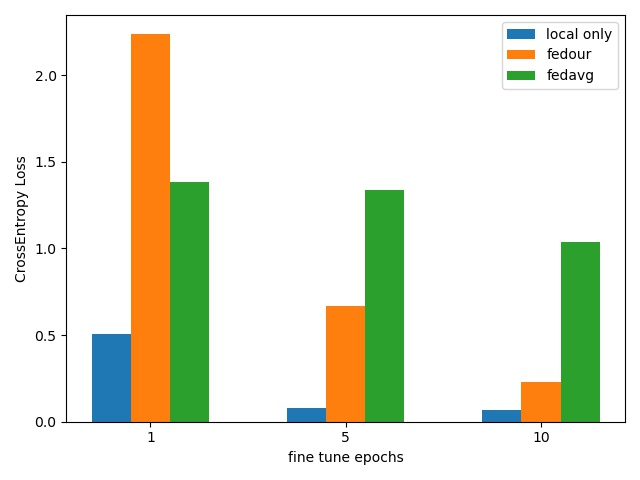

>- Author: PenguinK
>- Field: FL, deep learning, image reconition
>- Chinese gitee website: https://gitee.com/penguink3
>- English gitub website: https://github.com/PenguinK32


# Dataset website
- cifar-10: http://www.cs.toronto.edu/~kriz/cifar.html
- MedMNIST: https://medmnist.com/
- COVID-19 Radiography Database: https://www.kaggle.com/datasets/tawsifurrahman/covid19-radiography-database/metadata

# Project structure
- model: models including ResNet18/34
- Run: FL methods of MVPFed, including local update and server aggregation
- utils: data spliting [sampling](utils/sampling.py)，option file [options](utils/options.py)，testing and evaluation [test](utils/test.py)
- FedOur: the enter of the MVPFed

# How to run this project?
1. you can change the settings in [options.py](utils/options.py), including:
    - selecting dataset(you need to download the dataset first)
    - experiment parameters
    - communication rounds and local epochs
    - selecting the models

2. run FedOur.py to start the experiment

```bash
python3 -m FedOur.py
```

# Part of the experiment's results
**note: you need to download the dataset first before the experiment, for covid-19 dataset, we have a dataset python class to helpy you load it. more info is seen in [dataset](dataset.py)**

## first
> Based on CIFAR-10, comparison with FedAvg, FedPer(Classify), FedPer(Classify + 1 Bock), FedRep(Classify) and FedOur

<div align="center">
    
</div>

<div align="center">
    
</div>

<div align="center">
    
</div>

<div align="center">
    
</div>

## second
> based on  MedMNIST, view the influence of numbers of clients(10, 50, 100), comparison with FedPer(Classify)

### BloodMNIST

<div align="center">
    
</div>

<div align="center">
    
</div>

<div align="center">
    
</div>

<div align="center">
    
</div>

<div align="center">
    
</div>

<div align="center">
    
</div>

### DermaMNIST

<div align="center">
    
</div>

<div align="center">
    
</div>

<div align="center">
    
</div>

<div align="center">
    
</div>

<div align="center">
    
</div>

<div align="center">
    
</div>

## third
> Nased on Chest X-Ray Images, comparison with FedAvg and local，view the effect of fine-tuning models. Our base layers does learn the ground-truth representation.

<div align="center">
    
</div>

<div align="center">
    
</div>

# Structure of MVPFed
- What is base + personalized layers:
    - We split personalized layers into connecting layers and classifier layers, and we respectively train the personalized layers and base layers in our methods.
    - The representation of local update:

<div align="center">
    
</div>

- Steps：
    1. Server init the weights of base layers, then send it to the clients
    2. Clients selected train update models(base + personalized layers) via local data，and send the base layers to the server
    3. Server aggregates the base layers
    4. The trained base layers could be seen as a feature extractor and could be used to be the fine-tuned pre-trained model through meta-transfer

<div align="center">
    
</div>

